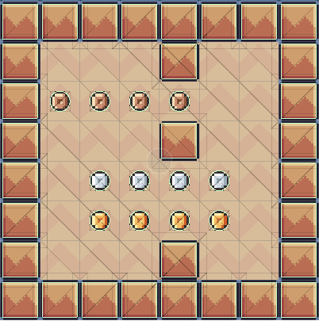

코인으로 부자되자!
플레이어는 최대 4명까지 할당 가능합니다.

C# 기준
- IPlayer 인터페이스를 구현하여 빌드한 다음 어셈블리(dll 파일)을 external/plugin 에 보관합니다.

> map 정보 예시



위와 같은 형태의 맵은 다음과 같이 표현됩니다.

column: 6
row: 6
```
0	0	0	-1	0	0
10	10	10	10	0	0
0	0	0	-1	0	0
0	30	30	30	30	0
0	100	100	100	100	0
0	0	0	-1	0	0
```

이를 배열로 전달할 경우 다음과 같은 형태의 배열이 됩니다.
```
int[] map = new[] {0,0,0,-1,0,0,10,10,10,10,0,0,0,0,0,-1,0,0,0,30,30,30,30,0,0,100,100,100,100,0,0,0,0,-1,0,0 }
```

column 과 row 는 IPlayer 인터페이스의 `Initiailize() 호출 시 함께 전달됩니다.
column 과 row 정보는 게임이 진행되는 동안 플레이어 인스턴스에서 유지해야하는 값입니다.

- C# 으로 알고리즘 작성 방법
1. 알고리즘 구현을 위한 프로젝트를 생성합니다.(C# library template 으로 생성합니다.)
2. 위 IPlayer 인터페이스가 포함된 PlayerLib.dll 을 참조합니다.
3. IPlayer 인터페이스를 구현합니다. IPlayer.cs 파일에 명시된 설명에 따라 정확히 구현합니다. 주된 구현 목표는 `IPlayer.MoveNext()` 메서드 입니다. 이 메서드가 게임 진행 시 플레이어의 이동 방향을 결정합니다.
4. 작성을 마쳤다면 프로젝트를 빌드하여 dll 을 생성합니다.
5. 생성된 dll 을 게임 폴더의 external/plugin 디렉토리에 복사하여 보관합니다.
6. 게임을 실행하여 동작을 확인합니다.